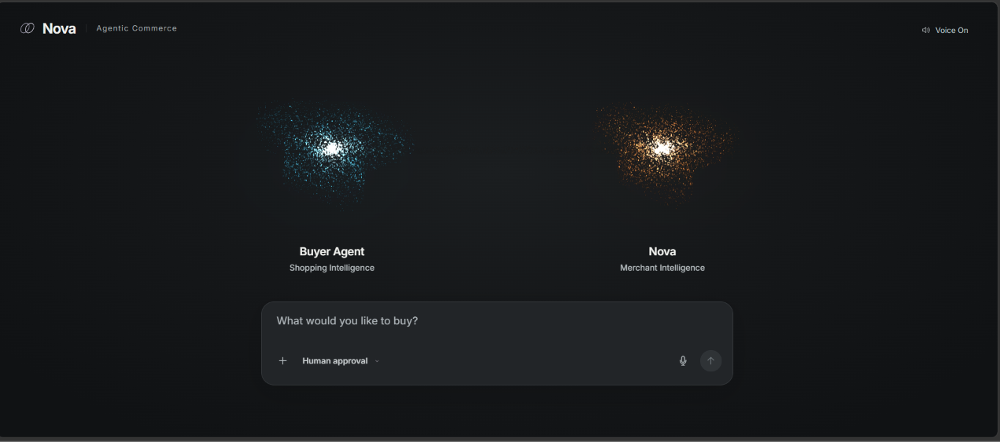
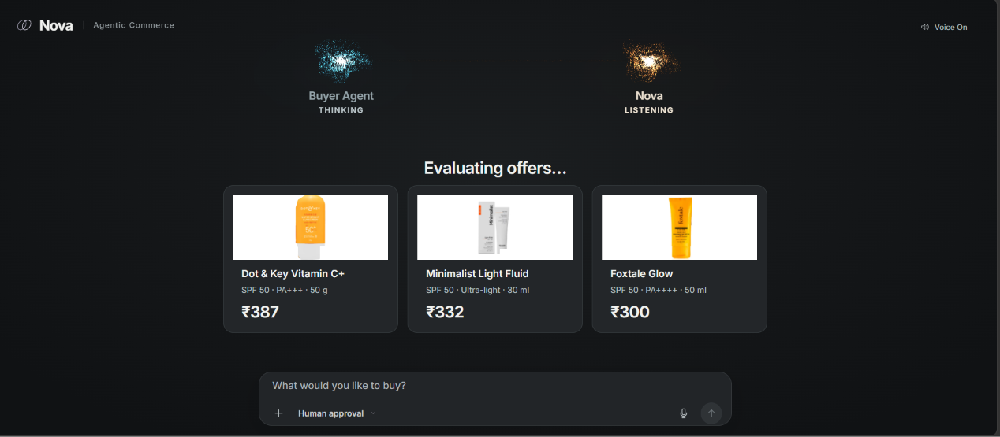
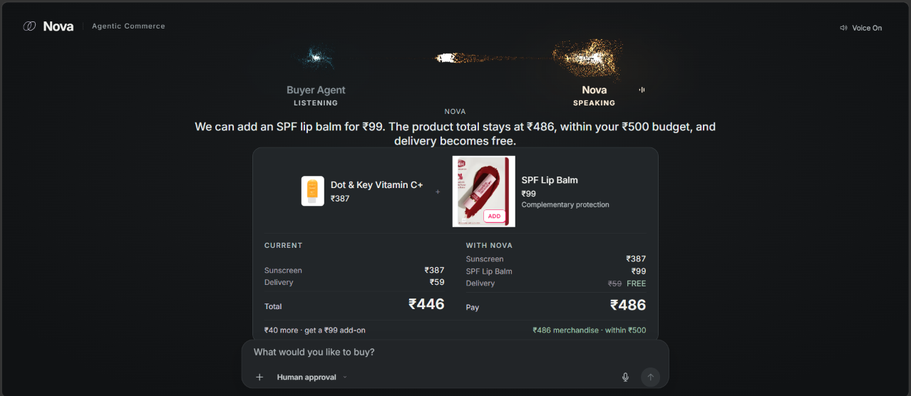
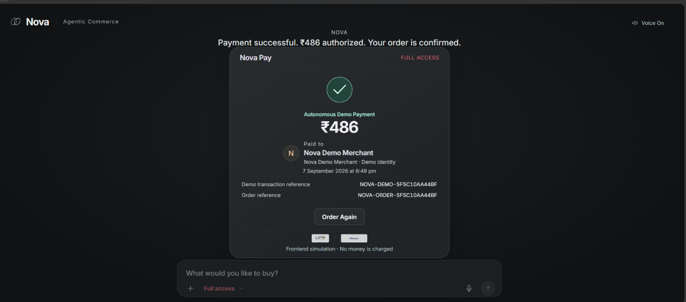
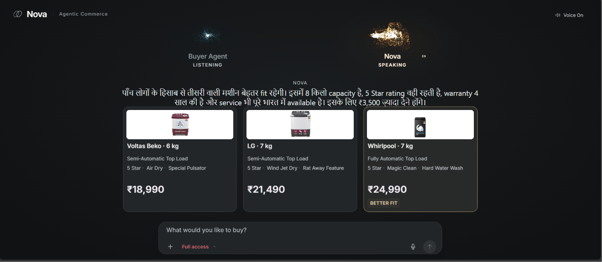
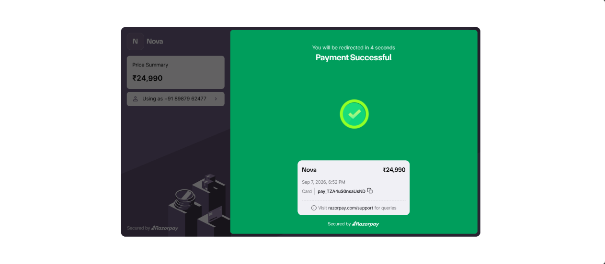
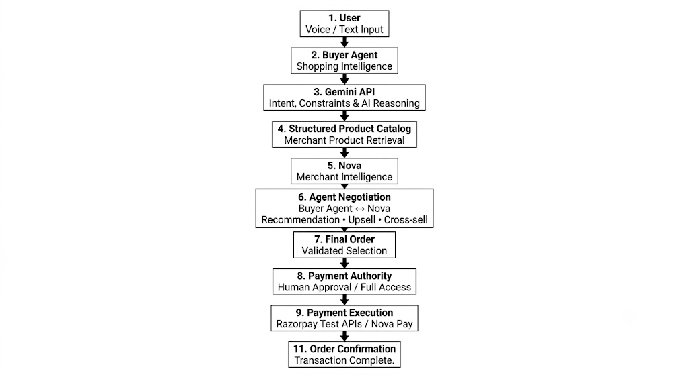
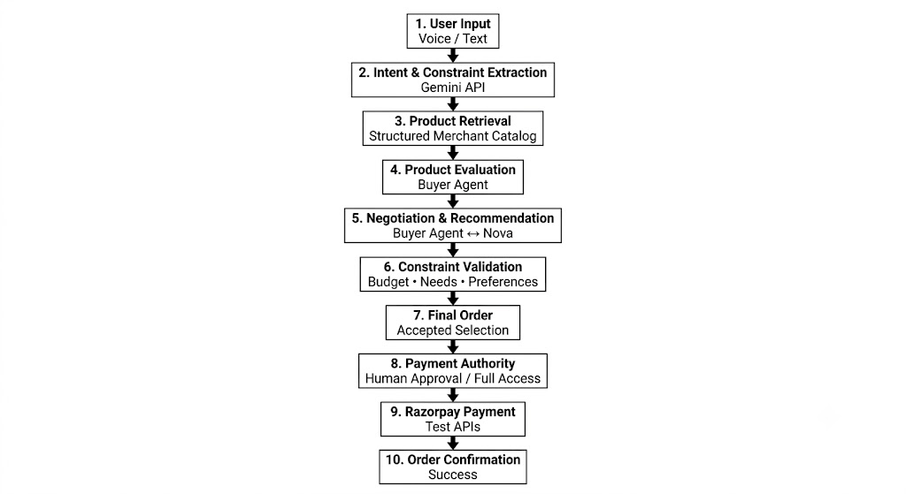

<div align="center">

# ◇ Nova — AI Merchant Agent for Agentic Commerce

### Turning AI buyer conversations into merchant growth — without violating buyer intent.


<br>

[▶ **Watch Demo**](https://youtu.be/5xZOXPBDyO8) &nbsp; • &nbsp;
[🚀 **Try Nova Live**](YOUR_VERCEL_LINK_HERE)

</div>

---

## 🎯 Problem Statement

AI agents are increasingly capable of searching, comparing and purchasing products for customers.

But if an **AI Buyer Agent represents the customer, who represents the merchant?**

Merchants need an intelligent layer that can **negotiate, upsell, cross-sell and grow order value** while still respecting buyer constraints and payment authority.

---

## 💡 Our Solution

**Nova** is a merchant-side AI agent that negotiates directly with a **Buyer Agent**.

```text
Buyer Agent  ←→  Nova
Customer          Merchant
Interest          Interest
```

Nova identifies legitimate opportunities to increase order value while keeping **budget, requirements, rejection and payment authority as hard boundaries**.

---

## ⚡ Key Highlights

| Feature | Implementation |
|---|---|
| 🤝 Agent Negotiation | Buyer Agent ↔ Nova Merchant Agent |
| 🧠 AI Intelligence | Gemini API |
| 🛍️ Product Retrieval | Structured merchant catalogs |
| 📈 Merchant Growth | Context-aware upsell & cross-sell |
| 🗣️ Voice | Sarvam AI |
| 💳 Payments | Razorpay Test APIs |
| 🔐 Payment Authority | Human Approval + Full Access |
| 📋 Explainability | Review + revenue impact |
| 🛡️ Safety | Buyer constraints always respected |

---

## 🚀 What Makes Nova Different?

| Existing Shopping AI | Nova |
|---|---|
| Represents the buyer | **Represents the merchant** |
| Recommends products | **Negotiates** |
| Generic upselling | Context-aware selling |
| Revenue-first optimization | Bounded by buyer constraints |
| Black-box decision | Explainable Review |
| Manual payment | Human + delegated authority |

---

## 🖼️ Project Preview

<table>
<tr>
<td width="50%"></td>
<td width="50%"></td>
</tr>

<tr>
<td></td>
<td></td>
</tr>

<tr>
<td></td>
<td></td>
</tr>
</table>

---

## 🏗️ System Architecture

<div align="center">



</div>

---

## 🤖 AI Processing Pipeline

<div align="center">



</div>

---

## 🛠️ Technology Stack

| Component | Technology |
|---|---|
| Frontend | React 19 + Vite 7 |
| AI | Google Gemini API |
| Voice / Audio | Sarvam AI |
| Product Catalog | Custom merchant catalogs inspired by Zepto, Blinkit & Instamart |
| Retrieval | Structured Catalog Retrieval |
| Payments | Razorpay Test APIs |
| Billing UX | BillMe-inspired |
| Testing | Playwright |
| Data Layer | Snowflake *(Planned)* |
| Deployment | Vercel |

---

## ⚙️ Getting Started

```bash
git clone https://github.com/Abhishekanand19/Razorpay_buildathon_2026.git

cd Razorpay_buildathon_2026

npm install

npm run dev
```

Add the required API credentials to your local environment:

```env
GEMINI_API_KEY=
SARVAM_API_KEY=
RAZORPAY_KEY_ID=
RAZORPAY_KEY_SECRET=
```

> Never commit API keys or secrets to GitHub.

---

## 🔮 Future Scope

- Live merchant catalog APIs
- Real-time inventory and pricing
- Snowflake data integration
- More Indian languages
- Dynamic negotiation strategies
- Merchant-defined negotiation policies
- Production-grade delegated payments
- Agentic commerce protocol support

---

## 📄 License

MIT License

---

<div align="center">

### ◇ Nova

**Buyer Intelligence × Merchant Intelligence × Agentic Payments**

Built for **Razorpay Buildathon 2026 — AI Growth & Agentic Commerce**

[Demo Video](https://youtu.be/5xZOXPBDyO8) •
[GitHub](https://github.com/Abhishekanand19/Razorpay_buildathon_2026) •
[Live Demo](YOUR_VERCEL_LINK_HERE)

</div>
